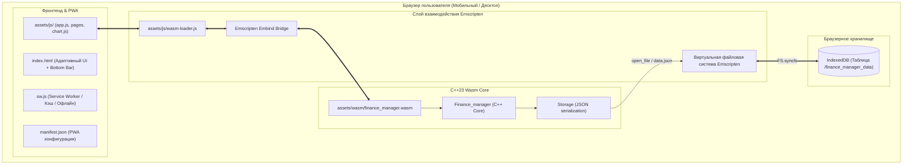

# 📱 Finance Manager (WebAssembly & PWA Edition)

[](https://webassembly.org/)
[](https://emscripten.org/)
[](https://web.dev/progressive-web-apps/)
[](https://www.apple.com/ios/)
[](https://mkaqxx.github.io/Finance_Manager/)
[](LICENSE)

> [!IMPORTANT]
> 🚀 **Онлайн-приложение доступно по ссылке:**  
> ### 👉 [mkaqxx.github.io/Finance_Manager](https://mkaqxx.github.io/Finance_Manager/) 👈
>
> 💻 **Десктопная версия приложения (Windows/WebView2):** находится в ветке [`main`](https://github.com/mkaqxx/Finance_Manager/tree/main).

---

## 📌 О веб-версии

Данная ветка содержит кроссплатформенную веб-версию и **Progressive Web App (PWA)** финансового менеджера. 

Оригинальное высокопроизводительное ядро бизнес-логики на **C++23** было скомпилировано в бинарный формат **WebAssembly (Wasm)** с помощью тулчейна **Emscripten**. Интерфейс был полностью переработан и адаптирован под мобильные устройства (в первую очередь iPhone / Safari), превращая веб-страницу в полноценное автономное приложение.

### 🌟 Ключевые преимущества веб-архитектуры:
1. **100% Client-Side (Zero-Backend):** Приложению не требуется сервер баз данных или бэкенд на Node.js/Python. Все вычисления, сортировки, фильтрации и построения отчетов производятся локально в браузере с нативной скоростью C++.
2. **Абсолютная конфиденциальность:** Ваши финансовые операции, доходы и остатки на счетах никогда не передаются по сети и не сохраняются на сторонних серверах.
3. **Персистентность через IDBFS:** Все данные автоматически сохраняются в виртуальной файловой системе Emscripten, которая синхронизируется с хранилищем **IndexedDB** браузера. Данные не пропадают при перезагрузке страницы или закрытии браузера.
4. **Автономность и офлайн-режим (PWA):** Благодаря Service Worker приложение кэширует все ресурсы и запускается даже при полном отсутствии подключения к интернету.

---

## 📲 Мобильная адаптация и опыт iOS (Native Look & Feel)

Интерфейс спроектирован по гайдлайнам мобильных приложений iOS:

* **Bottom Navigation Bar (Нижний таб-бар):** На экранах смартфонов ($\le 768\text{px}$) боковой десктопный сайдбар автоматически трансформируется в зафиксированное нижнее меню в стиле нативных приложений iOS.
* **Поддержка Safe Areas (Вырезы и Dynamic Island):** Использование CSS-переменных `env(safe-area-inset-top)` и `env(safe-area-inset-bottom)` предотвращает перекрытие контента "челкой" iPhone и системным индикатором жеста "Домой".
* **Удобные тач-зоны:** Размеры всех интерактивных элементов увеличены минимум до $44 \times 44\text{px}$ в соответствии с Apple Human Interface Guidelines.
* **Защита от автозума Safari:** Размеры шрифтов в полях ввода оптимизированы, чтобы предотвратить раздражающее приближение экрана в мобильном Safari при фокусе на полях ввода.

---

## 📲 Как установить на смартфон как приложение

### На iPhone / iPad (Safari)
1. Откройте в браузере Safari сайт: **[mkaqxx.github.io/Finance_Manager](https://mkaqxx.github.io/Finance_Manager/)**
2. В нижнем меню Safari нажмите кнопку **«Поделиться»** (иконка квадрата со стрелкой вверх $\uparrow$).
3. Прокрутите список действий вниз и выберите **«На экран "Домой"»** (Add to Home Screen).
4. Нажмите **«Добавить»** в правом верхнем углу.
5. На рабочем столе появится иконка **Finance Manager**. При запуске приложение откроется на весь экран без адресной строки и кнопок браузера, как настоящее нативное приложение!

### На Android (Google Chrome)
1. Откройте сайт в Google Chrome.
2. Нажмите на значок меню (три точки в правом верхнем углу).
3. Нажмите **«Установить приложение»** (или подтвердите всплывающее предложение «Добавить на главный экран»).

---

## 🏛️ Архитектура WebAssembly & IDBFS



---

## 📂 Структура файлов репозитория

Для корректной работы **GitHub Pages** и Service Worker корень репозитория оптимизирован для прямой раздачи:

```text
Finance_Manager (ветка web)/
├── index.html                  # Главная страница приложения (точка входа GitHub Pages)
├── manifest.json               # Манифест PWA (название, иконки, цвета, standalone режим)
├── sw.js                       # Service Worker для кэширования и работы без интернета
├── CMakeLists.txt              # Сборка Wasm через Emscripten (add_executable + emflags)
├── README.md                   # Документация веб-версии
├── assets/
│   ├── icons/                  # PWA иконки высокого разрешения (192px, 256px, 512px)
│   ├── wasm/                   # Скомпилированные артефакты WebAssembly
│   │   ├── finance_manager.js  # Сгенерированный JS рантайм Emscripten
│   │   └── finance_manager.wasm# Бинарный скомпилированный C++ модуль
│   └── js/                     # Модульный JavaScript интерфейса
│       ├── wasm-loader.js      # Загрузчик и инициализация Wasm модуля и IDBFS
│       ├── api.js              # Проксирование вызовов из UI в C++ API
│       ├── app.js              # Инициализация приложения, роутинг страниц
│       ├── chart.js            # Визуализация расходов (Chart.js)
│       ├── modals.js           # Обработка форм и модальных окон
│       └── pages/              # Компоненты страниц (счета, операции, бюджет, аналитика)
└── src/                        # Исходный код C++ (для компиляции через emcmake)
    ├── main.cpp                # Инициализация глобального C++ экземпляра для Wasm
    ├── core/                   # Бизнес-логика, хранилище, статистика, API
    ├── models/                 # Модели счетов, транзакций и бюджетов
    └── utils/                  # Форматирование дат и утилиты
```

---

## 🛠️ Сборка WebAssembly из исходников C++

Если вы внесли изменения в код C++ внутри папки `src/` и хотите перекомпилировать модуль WebAssembly:

### 1. Установка и активация Emscripten SDK:
```bash
# Клонируйте репозиторий emsdk (если не установлен)
git clone https://github.com/emscripten-core/emsdk.git
cd emsdk

# Загрузите и активируйте последнюю версию
./emsdk install latest
./emsdk activate latest

# Настройте переменные окружения в текущей сессии терминала
# В Windows (PowerShell):
./emsdk_env.ps1
# В Linux / macOS:
source ./emsdk_env.sh
```

### 2. Сборка проекта через `emcmake`:
```bash
# Перейдите в корень репозитория
cd /path/to/Finance_manager

# Сгенерируйте конфигурацию сборки для Emscripten
emcmake cmake -B build-wasm -DCMAKE_BUILD_TYPE=Release

# Запустите сборку
cmake --build build-wasm
```

После завершения компиляции обновленные файлы `finance_manager.js` и `finance_manager.wasm` будут автоматически записаны в директорию `assets/wasm/`.

---

## 💻 Десктопная версия

Нативная версия приложения для Windows (с использованием Microsoft Edge WebView2, системными окнами и сохранением в локальный файл `data.json`) доступна в ветке:
👉 **[`main`](https://github.com/mkaqxx/Finance_Manager/tree/main)**

