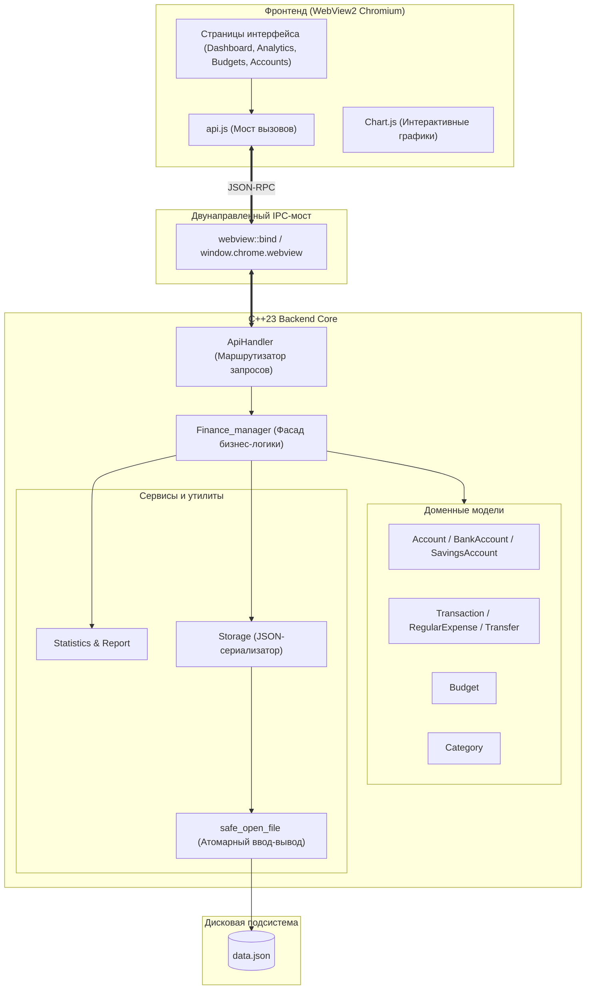

# 💰 Finance Manager (Desktop Edition)

[](https://en.cppreference.com/)
[](https://cmake.org/)
[](https://developer.microsoft.com/en-us/microsoft-edge/webview2/)
[-0078D6?style=flat&logo=windows)](https://www.microsoft.com/)
[](LICENSE)

> [!NOTE]
> **Это ветка `main`** — нативная десктопная версия приложения для Windows.  
> 🌐 **Веб-версия (WebAssembly + PWA для смартфонов и браузеров)** находится в ветке [`web`](https://github.com/mkaqxx/webFinanceManager/tree/web).  
> 🚀 **Онлайн демо веб-версии:** [mkaqxx.github.io/webFinanceManager](https://mkaqxx.github.io/webFinanceManager/)

---

## 📌 О проекте

**Finance Manager** — это высокопроизводительное десктопное приложение для комплексного учета личных финансов, планирования бюджета и аналитики расходов. 

В основе приложения лежит гибридная архитектура:
* **Ядро бизнес-логики и хранилище данных** разработаны на **современном C++23** с использованием объектно-ориентированного подхода, умных указателей, семантики перемещения и строгой типизации.
* **Пользовательский интерфейс** построен на веб-технологиях (HTML5, CSS3, ES6+ JavaScript, Chart.js) и отображается внутри нативного легковесного контейнера **Microsoft Edge WebView2** (Chromium).
* Взаимодействие между C++ ядром и интерфейсом осуществляется через асинхронный двухсторонний мост **JSON-RPC (IPC)**.

---

## ✨ Основные возможности

### 🏦 Управление счетами и кошельками
- Создание счетов различных типов:
  - **Обычные счета / Наличные** — учет свободных средств.
  - **Банковские карты** — привязка последних 4 цифр номера карты для быстрой идентификации.
  - **Накопительные счета / Цели** — установка целевой суммы накоплений и дедлайна с расчетом прогресса.
- Поддержка мультивалютности (RUB, USD, EUR и др.).
- Автоматический пересчет общего баланса капитала.

### 💸 Учет доходов и расходов
- Быстрое добавление транзакций с указанием суммы, категории, счета списания/пополнения и даты.
- Переводы между собственными счетами без искажения статистики расходов.
- **Регулярные платежи (подписки, аренда, зарплата)**: автоматический расчет следующей даты списания и периодичности (ежедневно, еженедельно, ежемесячно, ежегодно).
- Фильтрация и поиск операций по дате, типу и категориям.

### 📊 Категории и бюджетирование
- Гибкая система категорий с персонализированными цветовыми метками и разделением на доходы/расходы.
- Установка ежемесячных лимитов бюджета по отдельным категориям.
- Интерактивные индикаторы прогресса расходов и предупреждения о превышении бюджета.

### 📈 Аналитика и интерактивные отчеты
- Визуализация структуры расходов в виде круговых диаграмм (Donut charts на базе Chart.js).
- Графики динамики доходов и расходов по дням и месяцам.
- Статистические сводки: средний дневной расход, максимальные траты, норма сбережений.

### 🛡️ Безопасность и локальное хранение данных
- Все финансовые данные хранятся исключительно локально на вашем компьютере (`data.json`).
- Реализована **атомарная запись через временные файлы** (`.tmp`), исключающая повреждение данных при внезапном сбое питания или завершении процесса.

---

## 🏛️ Архитектура системы



---

## 📂 Структура проекта

```text
Finance_manager/
├── CMakeLists.txt              # Сценарий сборки CMake (C++23, WebView2 SDK FetchContent)
├── README.md                   # Документация десктопной версии
├── assets/                     # Ресурсы графического интерфейса
│   ├── index.html              # Главная разметка десктопного интерфейса
│   └── js/
│       ├── api.js              # Обертка над window.chrome.webview для вызова методов C++
│       ├── app.js              # Инициализация приложения и маршрутизация
│       ├── chart.js            # Модули построения графиков
│       ├── modals.js           # Логика модальных окон добавления/редактирования
│       └── pages/              # Логика отдельных страниц (dashboard, accounts, etc.)
├── src/                        # Исходный код C++
│   ├── main.cpp                # Точка входа WinMain, создание окна webview
│   ├── resources.rc            # Ресурсы Windows (иконка приложения .ico)
│   ├── json.hpp                # nlohmann::json (Header-only JSON библиотека)
│   ├── models/                 # Модели данных
│   │   ├── account.h/.cpp      # Базовый и дочерние классы счетов
│   │   ├── budget.h/.cpp       # Класс лимита бюджета
│   │   └── transaction.h/.cpp  # Иерархия классов транзакций
│   ├── core/                   # Ядро системы
│   │   ├── api_handler.h/.cpp  # Регистрация методов API для JS
│   │   ├── finance_manager.h/.cpp # Главный менеджер и хранилище состояния
│   │   ├── report.h/.cpp       # Генератор текстовых и структурных отчетов
│   │   ├── statistics.h/.cpp   # Расчет аналитических показателей
│   │   └── storage.h/.cpp      # Сериализация и сохранение в data.json
│   └── utils/                  # Вспомогательные утилиты
│       ├── chrono_to_string.h/.cpp # Форматирование дат и времени C++20/23
│       └── safe_open_file.h/.cpp   # Безопасная работа с потоками ввода-вывода
└── webview/                    # Кроссплатформенная библиотека webview (C++ / Edge Chromium)
```

---

## 🛠️ Требования к окружению

| Компонент | Минимальная версия | Примечание |
| :--- | :--- | :--- |
| **ОС** | Windows 10 / 11 (x64) | Стандартная 64-битная система |
| **Компилятор** | MSVC 19.34+ (Visual Studio 2022 v17.4+) | Требуется полная поддержка стандарта **C++23** |
| **CMake** | 3.14 или новее | Система конфигурации и сборки |
| **WebView2 Runtime** | Evergreen (актуальная версия) | Предустановлен в Windows 10/11 |

> [!TIP]
> **Microsoft WebView2 SDK** скачивается автоматически на этапе генерации проекта CMake через механизм `FetchContent` из официального репозитория NuGet — ручная установка не требуется!

---

## 🚀 Сборка и запуск

### Вариант 1: Сборка через Visual Studio 2022 / CLion
1. Откройте папку проекта `Finance_manager` как проект CMake в вашей IDE.
2. Выберите конфигурацию **Release** (или **Debug**) и архитектуру **x64**.
3. Запустите сборку и цель `FinanceManager.exe`.

### Вариант 2: Сборка через командную строку (PowerShell / CMD)

1. Клонируйте репозиторий и перейдите в ветку `main`:
   ```bash
   git clone https://github.com/mkaqxx/webFinanceManager.git -b main
   cd webFinanceManager
   ```

2. Сгенерируйте файлы сборки:
   ```bash
   cmake -B build -A x64 -DCMAKE_BUILD_TYPE=Release
   ```

3. Скомпилируйте проект:
   ```bash
   cmake --build build --config Release
   ```

4. Запустите готовый исполняемый файл:
   ```bash
   ./build/Release/FinanceManager.exe
   ```

---

## 🔄 Связанные ветки

* **[`web`](https://github.com/mkaqxx/webFinanceManager/tree/web)** — Порт приложения под WebAssembly (Emscripten) и адаптированное мобильное PWA (Progressive Web App) для iPhone и Android с хостингом на GitHub Pages.
